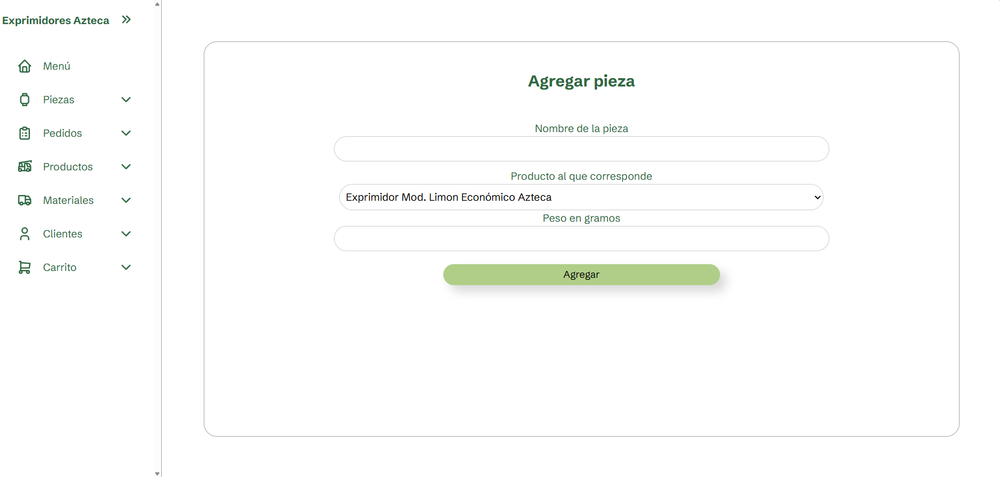
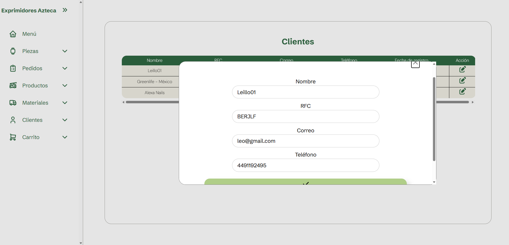
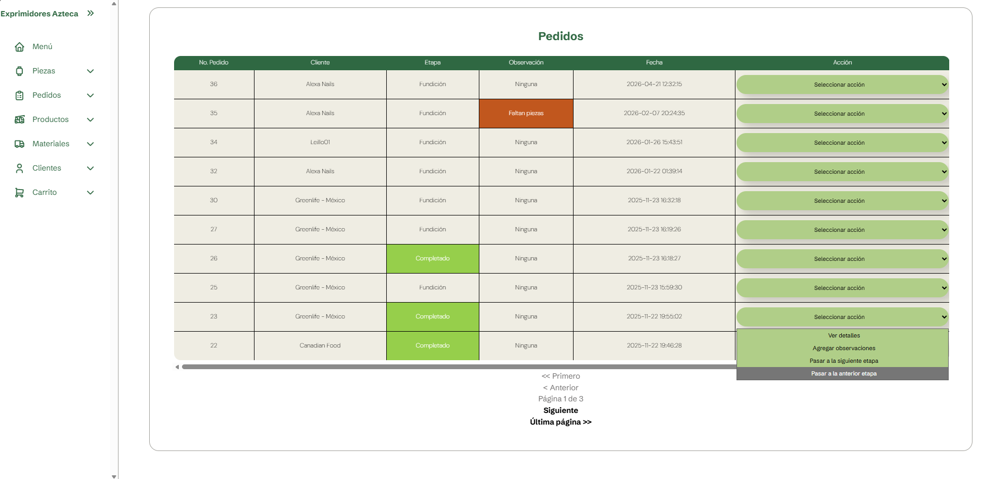

# Exprimidores Azteca

This is a project made for Exprimidores Azteca.
It is a tracking software for pieces and for entrances and exits of aluminum, through orders and a shopping car. 
It´s dedicated only for admins of this bussiness.

## What can you do here?

It´s hard to find any plus from this local-website because of neccesities so specifics. 
But here´s what can do it from what i learned.

## Insert data - Forms

You can add data from forms using prepared statements in PHP in the next fields: 

- Add Clients
- Add products
- Add products in "shopping car"
- Add entrances
- Add orders
- Add pieces

---

## Manage information in tables: Edit and delete information

You can edit information from a dialog. After doing this simple dialog ive learnt a lot. Like manage petitions from JavaScript to PHP (making a kind of restAPI, i don`t even know what does that mean, gemini said me that).

---

## Visualize dynamic tables

The main purpose for this website-application from the start has been having a managment for entrances and outputs of aluminium. Well, this is the "main" table of all my mini-website. 
You can skip or go back in steps depending on what stage of work are you doing. 
You can`t skip a step until you dont have any observation in your order.

---

## Plus 

It´s a very responsive website, you can grow it and shrink it, and everything will response properly (There´s no smartphone version yet).

> Try it yourself

#### Credits

This proyect was realeased by: 

- Leillo000
- Leka-efim